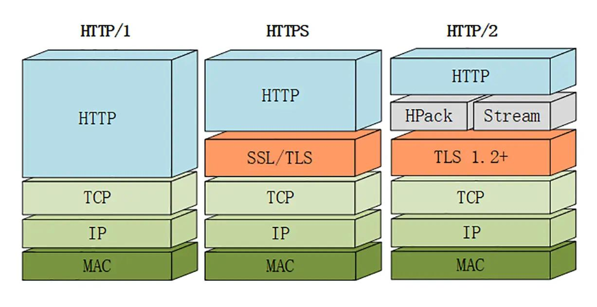
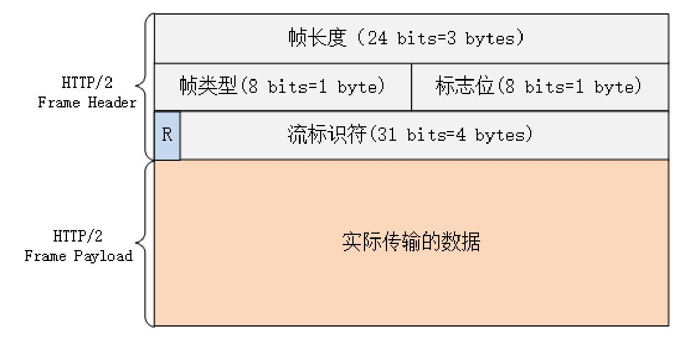

## HTTP/2版本

### HTTP/1.1的缺点
在学习HTTP/2的新特性之前，我们先思考一下之前的HTTP/1.1版本有哪些缺点？这些缺点是如何促进了HTTP的发展并演变出了HTTP/2协议版本。
1. 队头阻塞导致资源响应速度降低
2. HTTP无状态的特性带来巨大的头部信息
3. HTTP/1.1明文传输的特点导致其安全性低
4. 不支持服务器主动推送消息给客户端

### HTTP/2版本介绍
随着HTTP/1.1发布后互联网飞速的发展，HTTP/1.1队头堵塞以及明文传输不安全的问题急需解决，于是Google公司首先在自家的浏览器上Chrome首先使用SPDY协议(SpeedY),最终实践证明SPDY协议取得了成功。所以2015年，国际互联网标准化组织在SPDY协议的基础上，发布了HTTP/2，也就是RFC7540号文档。

由于HTTPS已经解决了HTTP明文传输不安全的问题，所以HTTP/2就聚焦于提高HTTP传输时的速度和性能。HTTP/2在语义上和HTTP/1.1完全一致，也就是请求方法、头字段、状态码等概念都完全一致，是高度兼容HTTP/1.1的。但是在语法层面HTTP/2做了很多改变，完全颠覆了以往HTTP报文的传输格式。

自从HTTP/2开始，HTTP/2工作组决定不再继续沿用之前的HTTP/1.0、HTTP/1.1这种带有小数点的小版本号，而是直接使用HTTP/2这种不带小数点的大版本号，也就是之后的HTTP版本会是HTTP/3、HTTP/4...,他们认为这样可以明确无误的辨别出协议版本的跃进程度，让协议在一段较长的时间内保持稳定，而且往后每一次版本的升级绝对会带来本质的改变，不会再有小的变动和优化。


### HTTP/2新特性

#### 1. 引入头部信息压缩机制(HPACK算法)
在HTTP/1中可以使用头字段Content-Encoding来指定数据实体body的编码方式，比如使用gzip压缩算法对数据进行压缩来节约带宽，但是报文的另外一个部分也就是Header却被忽视了。

一般情况下HTTP的Header中都会携带Cookie、User Agent、Accept等一些必须的头字段，但是这些固定的头字段都是重复的，并且有些情况下比body实体的数据都要大，这导致大量带宽都浪费在传输这些重复的头字段数据上。

为了解决这个问题，HTTP/2引入了头信息压缩机制，采用专门的HPACK算法，在客户端和服务器两端共同建立一个字典，用索引号来表示重复的字符串，并且采用哈夫曼编码来压缩整数和字符串，压缩率高达50%-90%。

#### 2. 规定报文(Header+Body)全面采用二进制格式
HTTP/1.1版本规定其头信息必须是ASCII编码的文本，数据实体可以是文本也可以是二进制数据，文本虽然对人友好但是却不利于计算机解析和处理。

所以HTTP/2版本规定报文不再使用原先的ASCII编码的文本，而是统一全部采用二进制格式。具体来说就是将Header+Body的消息打散为数个小片的二进制帧(frame)，帧分为两类：用HEADERS帧存放头数据，用DATA帧存放实体数据，经过HTTP/2分帧之后的Header+Body的报文结构完全消失了，协议看到的只是一个个的二进制帧碎片。

#### 3. 提出虚拟流概念,实现多路复用解决TCP队头阻塞问题
HTTP/2将报文分解为一个个的二进制帧之后进行传输，那么这些帧到达目的地之后该如何组装起来呢？

HTTP/2基于此专门定义了一个虚拟的"流"(Stream)的概念，流是专门用来传输上述二进制帧的双向传输序列，并且同一个请求和响应往返的帧会分配唯一的一个流ID，所以在流里面流动的其实是一串有着先后顺序的二进制帧，这些帧按照次序组装起来就是HTTP/1中的请求报文和响应报文。

HTTP/2基于流的概念，实现了在一个TCP连接上用流同时发送多个碎片化的帧，反正这些二进制帧上面都会有一个唯一的流ID，这就是HTTP/2推出的多路复用(Multiplexing)，即多个往返的通信都复用一个TCP连接来处理。这解决了HTTP/1.1以来一直被诟病的TCP队头阻塞问题，也就是说一个TCP连接中不仅可以并行发起多个请求，并且服务端可以并行响应多个请求，多个请求和响应之间没有严格的顺序关系，不再需要排队等待连接，也就不会再出现TCP队头阻塞问题，大幅度提高了连接的利用率。

为了更好的复用TCP连接，HTTP/2还添加了一些控制帧来管理虚拟的流，实现了优先级和流量控制。

帧在发送到一半的时候，客户端和服务端都可以发送信息(RES_SEREAM帧)来取消这个帧。HTTP/1.1取消帧的唯一方法就是断开TCP连接；而HTTP/2可以取消某一次请求但是保持TCP连接任然开启，可以被其他请求复用。
客户端可以指定帧的优先级，优先级越高，服务器就会越早进行回应。
   
由于 HTTP/2中的流可以实现HTTP/1.1中的管道功能(即可以在同一个TCP连接中并行发起多个请求),并且综合性能更好，所以管道在HTTP/2被废弃了。


#### 4. 基于流实现了服务端主动推送Server Push
HTTP/2在一定的程度上改变了以往"客户端请求-服务端应答"的工作模式，服务器在必要的场景下可以新建流主动向客户端推送数据，这称做HTTP/2的服务端推送Server Push。

HTTP/2允许允许服务器在需要的时候主动发起对客户端的连接并推送数据。常见的场景是客户端请求一个index.html网页，这个网页中包含了css样式表、js脚本和图片等静态资源。

正常的请求是浏览器接收到index.html文件之后交给渲染引擎解析html的时候，发现需要css、js等这些静态资源，所以浏览器再接着发起请求这些静态资源的请求。

HTTP/2在处理的时候，其实服务器是可以预料到客户端接收到index.html的时候要接着请求静态资源，所以就会主动把这些静态资源随着网页一起主动推送给客户端，减少了客户端再次发起请求的时间。

#### 5. 强化安全基于加密协议传输数据(TLS1.2+)
出于兼容HTTP/1.1的考虑，HTTP/2延续了HTTP/1.1明文的特点，可以使用明文传输数据，并不强制使用加密通信。

但是由于HTTPS已经成为当今互联网的大势所趋，并且主流浏览器都宣布只会支持加密的HTTP/2,所以虽然HTTP/2支持不加密明文传输，但是当今互联网上的HTTP/2基本都是使用'https'作为协议名，跑在TLS层之上的，但是TLS的版本必须是1.2+以上的版本。

为了区分HTTP/2的明文和加密两个不同的版本，HTTP/2协议定义了两个字符串标识符：
+ h2：表示是HTTP/2的加密版本
+ h2c：表示是HTTP/2的明文版本，c代表clear text(明文)


### HTTP/1\HTTPS\HTTP/2的协议栈对比
+ HTTP/1：MAC物理层 + IP网络层 + TCP传输层 + HTTP应用层
+ HTTPS： MAC物理层 + IP网络层 + TCP传输层 + SSL/TLS安全层 + HTTP应用层
+ HTTP/2：MAC物理层 + IP网络层 + TCP传输层 + TLS1.2+安全层 + HPack Stream + HTTP应用层
   


   
### HTTP/2中压缩头字段的HPACK算法

HPCAK算法是HTTP/2专门为压缩头部信息所制定的一套算法，它与传统的gzip等压缩算法不同，它是一个有状态的算法，需要客户端和服务端各维护一张头部信息的索引表,也可以认为是字典，而基于HPACK算法压缩和解压缩的过程其实本质上就是查询表和更新表的操作。具体的操作规则是：
1. 对于每次请求和响应发送的相同的头部字段和值，不再重复进行发送，而是只发送一个对应的索引号即可
2. 每个新的头部字段或者说自定义头部字段，要么会添加到动态表的末尾，要么用新值替换旧的值

> 静态表 Static Table
值得注意的是，HTTP/2为了方便管理和压缩头部信息，它将原来HTTP/1中的起始行信息也就是请求方法、请求URL、响应状态码、HTTP协议版本等信息都统一转化成了头字段的形式，并且给这些字段起了一个特殊的名字："伪头字段"。为了与原本真实的头字段区分开来，所有这些"伪头字段"都会在名字前面加一个冒号":"，比如:status:200代表响应状态码,:authority代表域名,:method代表请求方法等。经过将原来请求行或响应行信息统一处理为头字段key-value形式之后，HTTP/2在发送报文头部的时候就全是键值对的形式了，于是HTTP/2就为一些最常见的头字段定义了一个只读的“静态表”。当然在HTTP/2中原来的请求行和响应行这些概念就被废弃了。

> 动态表 Dynamic Tbale
如果遇到表里只有key没有对应的value，或者说自定义的字段时，就需要用到"动态表",它添加在静态表后面，结构是一样的，但是会在编码解码的时候更新数据。
比如user-agent这个头字段，一开始服务端是不知道客户端代理到底是什么值。所以在客户端第一次发送请求之后，假设User-Agent字段的值是: 'Mozilla/5.0 (Windows NT 10.0; Win64; x64) AppleWebKit/537.36 (KHTML, like Gecko) Chrome/96.0.4664.45 Safari/537.36'，首先客户端会用哈夫曼压缩编码之后发送给服务端，然后客户端和服务端都更新自己的动态表，并添加一个新的索引号60，此后的请求如果还需要发送user-agent这个头字段只需要发送一个索引号60就可以了，就不用每次请求都重复发送具体的值了，因为服务端基于索引号可以查询到这个头字段的值。

如下是一个简单的头部字段表示例：
```js
Index(索引列)   Header Name(头部字段名)   Header Value(头部字段值)
1				:authority				  www.google.com	
2				:method             	  GET
3				:method					  POST
4				:path					  /
5				:scheme					  https
6				:scheme					  http
......	
60				user-agent				  Mozilla/5.0 (Windows NT 10.0; Win64; x64)...
```


### HTTP/2中的二进制帧数据结构

#### 计算机中的存储单位
1TB = 1024GB
1GB = 1024MB
1MB = 1024KB
1KB = 1024Bytes
1Bytes = 8Bit
1个Bit就是一个二进制位，值不是0就是1
1个Bit是存储层面上的最小单位

#### 二进制帧的组成及大小
每一个二进制帧都有两部分组成，也就是帧头和帧正文(实际传输的数据体)。
Frame Header：二进制帧头大小都是9个字节bytes，也就是72个比特bits大小。
Frame Payload：二进制帧实际传输的数据体大小区间通常为0-2^14bits，最大可到2的24次方比特。

#### 二进制帧头的组成
二进制帧Frame Header的头部组成如下：

1. 帧长度 Frame length
   占3字节大小，代表当前这个二进制帧的payload部分的数据长度。默认上限为2^14bits。
   
2. 帧类型 Frame Type
   占1字节大小，HTTP/2为帧定制了10种类型的帧，但是大致可以分为数据帧和控制帧。如下是10种帧类型及其说明：
   比如帧的类型为HEADERS,那么这个二进制帧的payload就装载的是被HPACK算法压缩过的头部报文信息。
```js
类型			对应类型码及说明				
DATA			0x0	数据帧，传输应用需要的数据
HEADERS			0x1	消息头帧，传输头信息，包括请求头、响应头等
PRIORITY		0x2	优先级帧，设定流优先级
RST_STREAM		0x3	流终止帧，中断流或者表示发生了一个错误，不中断连接
SETTINGS		0x4	设置帧，设置该连接的参数，作用于整个连接
PUSH_PROMISE	0x5	推送帧，服务端推送时使用，客户端可以返回一个RST_STREAM 帧来拒绝推
PING			0x6	PING帧，判断空闲连接是否可用，测量最小往返时间 (RTT)
GOAWAY			0x7	GOAWAY帧，发起关闭连接，或者警示严重错误。关闭连接前会处理完已建立的流
WINDOW_UPDATE	0x8	窗口更新帧，流量控制。可以针对某个流，也可以针对整个连接
CONTINUATION	0x9	延续帧，示意继续传输数据
```

3. 帧标志信息 Frame Flag
   占1字节大小，可以保存8个标志位，用于携带简单的控制信息。比如：
```js
END_HEADERS 表示头数据结束
END_STREAM  表示单方向数据发送结束
```

4. 流标识符 StreamID
   占4字节大小，除了最高位不可用之外，剩余的31位都是可以使用的，也就是说流标识符的最大上限是2的31次方个。接收方就可以按照流的标识符从乱序的帧里面识别出来具有相同流ID的二进制帧，并把这些帧按照顺序组装起来，就实现了一个虚拟的流。

### HTTP/2中的流的特点

> 什么是HTTP/2中的流？
HTTP/2中的流是虚拟的，它是二进制帧双向传输的序列。

> HTTP/2中的流是如何实现多路复用的？
在HTTP/2中，虽然二进制帧是乱序收发的，但是因为每一个帧的头部都有一个流ID，基于这个流ID就可以做到只要是相同流ID的二进制帧，那么它们就属于一个流，并且有一个重点是在tcp连接层面上帧是乱序的，但是在相同流ID形成的这个虚拟的流中，帧是有严格先后顺序的。至于同一个流的帧是如何做到先后顺序的，这是由传输层的tcp协议来控制的。

> HTTP/2中的流有哪些特点？
1. 流是双向的，一个流里面客户端和服务器都可以发送或接收帧
2. 流是可并发的，一个HTTP/2连接上可以同时发出多个流传输数据，基于此可以实现多路复用
3. 流和流之间是独立的没有关系，但是流中传输的帧是有严格顺序的
4. 客户端和服务器都可以创建流，基于此HTTP/2具备了服务端推送的能力，服务器可以先发起一个PUSH_PROMISE类型的帧通知客户端要推送数据，客户端如果想要拒绝推送就可以回复一个RST_STREAM类型的终止帧通知服务端停止推送数据。
5. 流可以设置优先级，让服务器来优先处理某些请求（priority）
6. 流的ID不可以重复使用，一般客户端发起的流ID是奇数，服务端发起的流ID是偶数
7. 客户端和服务端都可以发送RST_STREAM类型的帧来中断流和传输数据，但是tcp连接任然保持连接

### HTTP/2中流的状态控制

HTTP/2中流的状态是通过同一流中帧头上的标志位来控制的。
流的生命周期就是"空闲-打开-半关闭-关闭",等同于HTTP/1.1中的一次请求-应答过程。

> 空闲状态
  一开始，流为空闲状态，也就是等待分配流ID的时候
> 打开状态
  客户端发送一个类型为HEADERS的帧之后，此时流ID产生，流的状态变为打开状态
> 半关闭状态
  直到客户端发送一个标志位为'END_STREAM'的帧，代表客户端数据已经发送完毕，等待接收响应数据，此时流的状态变为半关闭状态
> 关闭状态
服务端处理请求之后发送响应数据，直到服务端也发送一个标识位为'END_STREAM'的帧，代表服务端数据已经发送完毕，此时流的状态变为关闭状态

下一次客户端发起新的请求就要新分配一个流的ID，重新上述的流程；当流的ID到达上限之后，就会发送一个类型为'GOAWAY'帧来开启一个新的tcp连接，流的ID又可以从头开始按照顺序计数。

### HTTP/2和HTTP/1.1的对比

1. HTTP/1.1的头部信息都是文本格式，HTTP/2的报文头部和报文实体全部都是二进制帧进行传输。
2. HTTP/1.1是明文传输，并且不依赖于TLS安全层协议;HTTP/2虽然说有h2c版本，但是现有浏览器支持的HTTP/2基本都是基于TLS1.2+版本的加密传输。
3. HTTP/1.1每次传输都会携带巨大的头部字段数据，HTTP/2基于HPACK算法和哈夫曼编码对头部进行了压缩
4. HTTP/1.1的管道机制导致了tcp连接的队头阻塞，HTTP/2基于虚拟的流和二进制帧实现了多路复用
5. HTTP/1.1需要维护多个tcp连接，HTTP/2只需要维护一个tcp连接就可以实现多个请求和响应的数据传输
6. HTTP/1.1不能主动从服务端推送数据到客户端，HTTP/2可以基于特殊的PUSH_PROMISE帧实现服务端主动推送
7. HTTP/1.1不能实现请求的优先级排序