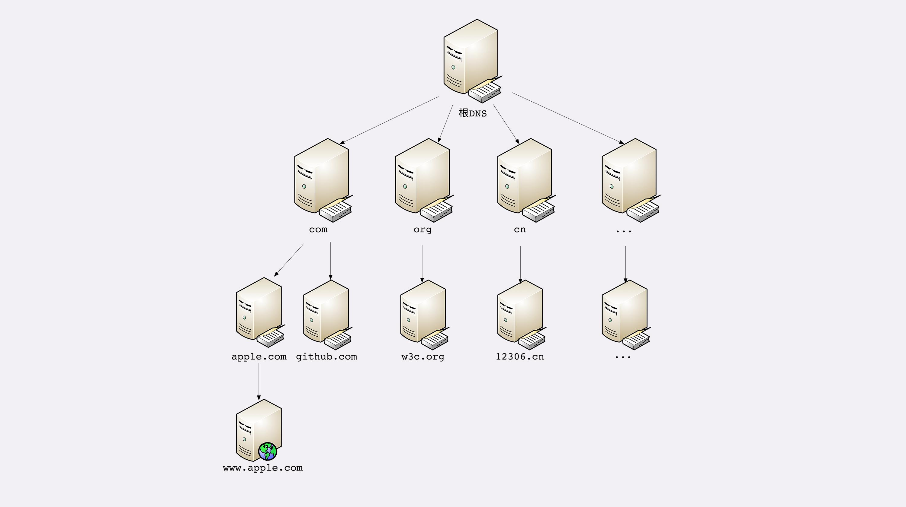

## 域名的层次
域名是一个有层次的结构，从字面上来看域名是一串用"."分隔的多个单词，域名的层次关系一般表现为：
最右边被称之为顶级域名，然后是二级域名，最左边是主机名，层级关系是从右向左依次递减的。
比如下面这几个域名：
```
cn.vuejs.org
www.gov.cn
mail.163.com
```
org、cn、com都是顶级域名
vuejs、gov、163是二级域名
cn、www、mail是主机名,一般用来表示主机的用途，比如www表示万维网服务，mail表示邮件服务

域名除了帮助人类可以方便更快的记住自己要访问的站点的IP地址之外，还有其他的用途：
1. 域名用来标识虚拟主机
在诸如Nginx这样的web服务器中，域名可以用来标识虚拟主机，决定由哪个虚拟主机来对外提供服务

2. 域名用做命名空间系统
由于世界上的每一个域名都是独一无二的，所以可以基于域名作为一种标识。比如java的包机制就采用域名作为命名空间，只是采用了反序的写法。

3. DNS查询是基于UDP协议，DNS协议也是应用层的协议，通常使用53号端口
## DNS的树形结构核心系统
基于DNS协议来将域名解析成为对应的IP地址，DNS的核心系统的组成部分是一个三层的树状、分布式服务，基本对应域名的结构：

1. 根域名服务器
用于管理顶级域名的服务器，返回com、cn、org等这些顶级域名服务器的IP地址。

2. 顶级域名服务器
管理各自域名下的权威域名服务器，比如上面的com顶级域名服务器返回163.com域名服务器的IP地址

3. 权威域名服务器
管理自己域名下主机的IP地址，比如163.com权威域名服务器返回mail.163.com的IP地址



## 提高DNS域名解析速度的手段：缓存
设想一下，如果全球每台设备发送请求获取资源的时候都使用这个DNS域名解析系统来获取IP地址，访问速度肯定会变得十分缓慢，那么要通过一些手段来减轻域名解析的压力，同时能够更快的获取结果，那么实现的主要手段就是缓存。

1. 非权威域名服务器缓存
大公司和网络运营商都会建立自己的DNS服务器，作为用户DNS查询的代理，代替用户访问核心DNS系统，这些自己创建的DNS服务器被称之为非权威域名服务器，可以缓存之前的查询结果，如果这些非权威域名服务器中缓存了记录，就可以直接将IP地址返回给用户，无需再去DNS核心系统自顶向下查询。

2. 操作系统缓存
我们使用的电脑的操作系统本身也会对当前设备的DNS解析结果做缓存记录，如果我们之前访问过某个网站，那么下一次再去访问这个站点的时候就不用再进行DNS解析了，操作系统会直接返回这个IP地址。

3. 用户自定义hosts文件域名记录
操作系统的C盘中保存了一个特殊的主机映射host文件，这是一个可以编辑的文件，里面保存了一些DNS域名解析的记录，用户可以在这个文件中自定义一些域名和IP的对应记录，如果操作系统的磁盘或内存中找不到DNS缓存记录，就会来这个文件中进行查询，这个文件的地址是："C:\windows\system32\drivers\etc\hosts"


## 浏览器地址栏中输入一个域名后DNS的解析过程
1. 查找浏览器自身的DNS缓存记录
2. 查找操作系统的DNS缓存记录
3. 查找hosts文件中域名记录
4. 访问非权威域名服务器缓存，如三大运营商的DNS域名服务器、企业内网DNS服务器等
5. 非权威域名服务器发起请求去查询根域名服务器
6. 查询顶级域名服务器
7. 查询权威域名服务器
8. 返回IP地址，如果还是查不到则返回查询错误：Failed host lookup